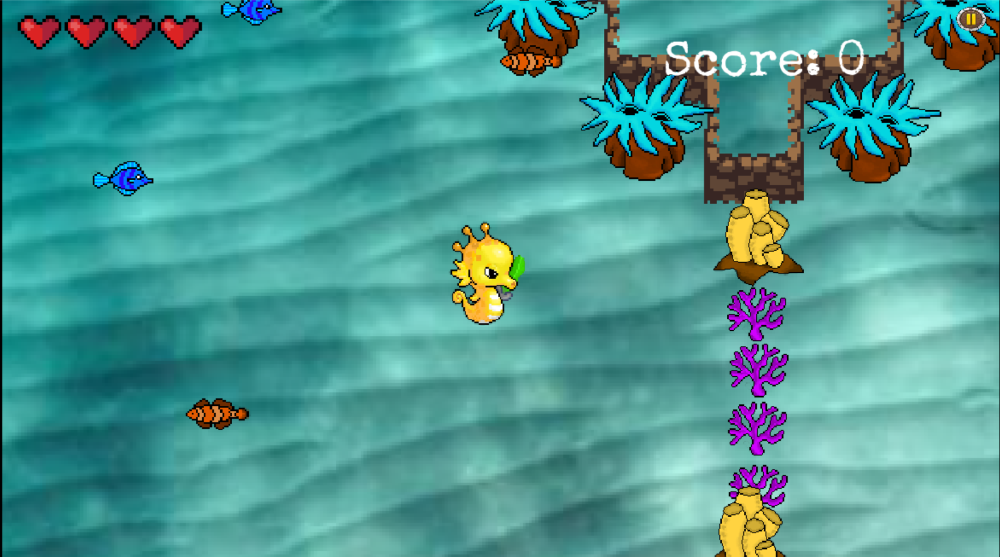

# A DOT.

<p align="center">
	
</p>

A DOT (A Desire of Treasure) is a treasure hunt game, using Godot Game Engine, based in a sea fantasy world, in which you will find a map of a very precious treasure. On the way to treasure you find various creatures whom you have to defeat and find the key to treasure.

### Features
- Available on Android and Windows
- Shop to upgrade your armors and weapons
- Power Ups to make the game a little easier
- Catalogue of enemies and different corals

### DEMO
Trailer video of the game is available on YouTube. Watch it [here](https://www.youtube.com/watch?v=Gh4qMadVl_s)
<br><br>

<br>

<br>


### Download
- To download game for Android [click here](https://github.com/IITian20/A-DOT/raw/master/Android/A%20DOT.apk)
- To download game for Windows download both files:
	* [File 1](https://github.com/IITian20/A-DOT/raw/master/Windows/A%20DOT.exe)
	* [File 2](https://github.com/IITian20/A-DOT/raw/master/Windows/A%20DOT.pck)
  <br>
  
  ```
  For Windows, after downloading both the files open the file with extension .exe to play the game.
  ```

### Setup
To contribute to the project you first have to download Godot Game Engine. 
- [Click here](https://godotengine.org/download) to download the Godot game engine.
- After cloning the repo in your local, open Godot Game Engine
- Click on the Import.<br> 
- Select the file project.godot from the folder Project.
- Click on Import and Edit.

Now you can edit the game and make contribution.

### Languages
All the script in the game are written in GD script language.


